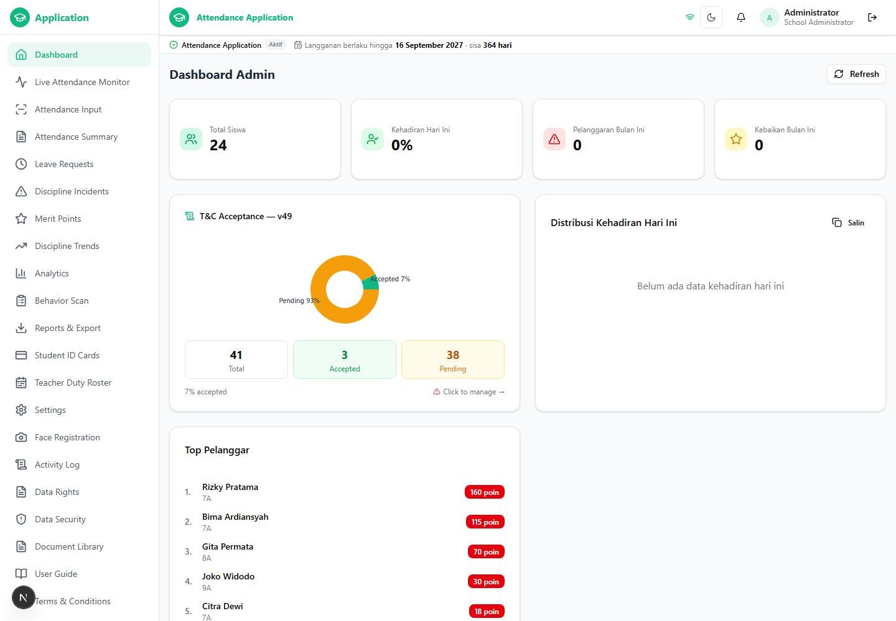
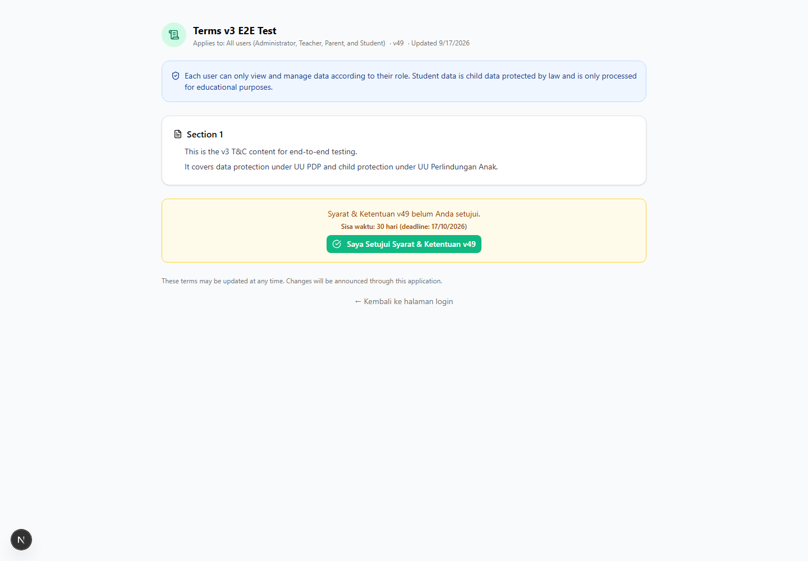
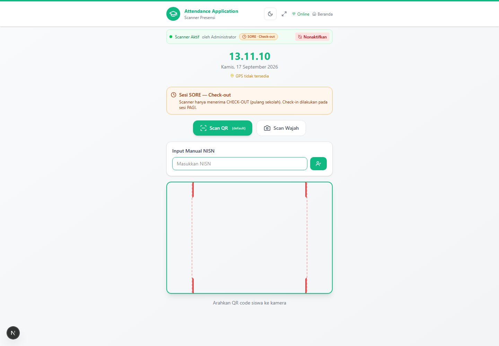

# Daily Report — Thursday, 17 September 2026

Scanned Attendance & Discipline App · branch `main` · commits `bdf4007` → `995972b`
Stack when captured: dev server `http://localhost:3000`, socket.io mini-service `:3003`,
PostgreSQL `:55432` — all three brought up by one command, `npm run dev:up`.

## Today in one line

The day was about making the local stack and its pipeline *trustworthy*: one script brings
the stack up and down, CI went green for the first time in 33 runs, and the port probes
that everything else depends on were caught telling less than the truth — then fixed and
measured rather than guessed at.

## Screenshots

### 1. Dashboard — the app running on the script's own bring-up



Signed in as `admin` (`ADMIN`) for school `SHB-001 — Attendance Application`. The full
sidebar is present — Dashboard, Live Attendance Monitor, Attendance Input, Attendance
Summary, Leave Requests, Discipline Incidents, Merit Points, Discipline Trends, Analytics —
and the page titles itself **Application Dashboard**. This is the screen that proves the
`dev:up` path end to end: the server it started is the server answering, with the school's
real data, and the socket relay connected for live updates.

### 2. Terms & Conditions — version 49



The T&C surface: content **`v3 E2E Test`**, published **v49**, *Updated 9/17/2026*, scoped
"Applies to: All users (Administrator, Teacher, Parent, and Student)". Relevant to today's
work in two directions: the acceptance statistics endpoint is what a school admin reads
here, and it is the same endpoint whose cross-school leak was scoped earlier in this
sprint. On this database only 2 of 41 users have accepted, which is why a *fresh* login
still has to tick the box — see [Known gaps](#known-gaps--next).

### 3. Scanner — attendance session live



`Scanner Presensi Online`, session **`SORE` (check-out)**, "Aktif oleh Administrator" with a
live timer and **Nonaktifkan** to end it. This is the surface the socket mini-service
feeds: the scan pages update from `:3003` rather than by polling, which is what the relay
token hardening and the socket service's own `SOCKET_PORT` fix protect.

> **How these were captured.** `daily-reports/capture-screenshots.mjs` drives headless
> Chrome over the DevTools Protocol — no browser-automation dependency, because navigating,
> setting one cookie and taking a screenshot are the only three things needed. It logs in
> through `/api/auth` and injects the resulting `token` cookie; a cookie alone still lands a
> school admin on the *school picker*, so it also writes the `school-auth-storage` state the
> login flow writes, using the `user` object the API returns. Each capture then reads the
> live DOM back (`location.pathname`, `document.title`, first visible text) and prints it,
> so the report states what is on screen rather than trusting that a file exists.

## Progress, commit by commit

| Commit | What changed |
|---|---|
| `bdf4007` | Scope every cross-tenant write to the actor's school; derive RBAC from one policy instead of four hand-maintained copies; bring the stack up and down through one script |
| `16f3a43` | Fix the typecheck gate the first CI run exposed; make a failing bring-up readable from the run page |
| `e981261` | Ask "is this port served" when waiting for a listener, not "can the OS name its pid" |
| `a818ae8` | Stop the HTTP suites from querying a module mock another file installed |
| `a48e74b` | Name the port owner by asking the next probe; make the suite's pid assertions degrade out loud |
| `f5d3ce8` | Make a skipped bring-up assertion visible in CI instead of silent |
| `67182a0` | Word the opt-in suite's skip as disclosure, not alarm |
| `04bd2de` | Resolve a port's owner through `/proc`, and measure what Linux actually reports |
| `c754781` | Say what the naming routes actually do; let the lab record a refusal |
| `995972b` | Document the three routes that can name a port's owner, and their limit |

### 1. The pipeline went green — for the first time

Thirty-three previous CI runs had all failed, so there was no baseline to lean on and none of
the failures were reachable from this Windows worktree. Each run's log turned out to be the
instrument: the bring-up step now re-emits the script's own `ERROR:` lines as annotations, and
that is how the first three causes were found.

- **The typecheck gate was wrong, not the code.** `bunx tsc` on the runner exits **2**
  (`DiagnosticsPresent_OutputsGenerated`) with the same 18 pre-existing diagnostics the local
  binary exits 1 for; the guard read "exit > 1" as "tsc never ran". It now treats 1 and 2 as
  "it checked something" and 3, 4 and "non-zero with no diagnostics" as the false greens it
  exists to catch.
- **Next was up the whole time.** `wait_for_port` polled `listener_pid`, so a stack that
  booted in 1.4 s burned its full 300-second window looking for a *name* for a port that was
  being served. "Is someone there" and "who is it" are now separate questions.
- **A process-wide module mock.** `bun`'s `mock.module('@/lib/db')` leaks across files, so a
  suite checking an effect against the real database silently queried a fake, and passed
  locally while failing on the runner purely because the file order differed. Both HTTP
  suites now build their client through `src/lib/test-db.ts`.

Result: **`a48e74b` was the first fully green run** (both jobs, bring-up and teardown included),
and the next five pushes have all been green.

### 2. A skip can no longer hide

A green step that skipped its assertions looked exactly like a green step that made them —
identical in `bun test`'s summary, and the job log needs repository admin rights to read. The
suite now emits a `::notice::` annotation for **every** skip, and the CI step fails outright if
the suite never ran or collected no tests. Worth noting the failure mode of the fix itself: the
first version of that notice was alarming and fired on a job where skipping is expected, which
reading a *passing* run is what caught.

### 3. The port probe told less than the truth — measured, then fixed

`dev:down` decides whether it may kill a process by comparing a recorded pid against the pid
the OS says owns the port, so what that probe reports *is* the safety property. Asked what a
Linux runner can actually name, the answer was **not** "the tools are broken":

| Route | A listener we started | Another user's listener (`docker-proxy`, root) |
|---|---|---|
| `lsof -ti tcp:N -sTCP:LISTEN` | `2453`, exit 0 | **exit 1, no output** |
| `ss -ltnpH` (as `runner`) | `users:(("node",pid=2453,fd=21))` | LISTEN rows with **`users:` omitted**, exit 0 |
| `sudo ss -ltnpH` | same | `users:(("docker-proxy",pid=2321,fd=7))` |
| `/proc/net/tcp` | inode `15368` | inode `15053` |

Attributing a socket to its holder needs to own it or hold `CAP_NET_ADMIN`/`CAP_SYS_PTRACE`;
the kernel's socket table is world-readable but the holder→pid step is not. CI manufactures
the unnameable case by publishing Postgres from a service container. The trap is `ss` exiting
0 with the pid silently dropped. So:

- `listener_pid` gained a third, dependency-free route — read the LISTEN socket's inode from
  `/proc/net/tcp`, find the process holding it as `socket:[inode]`. No lsof, no iproute2,
  nothing to install; a minimal image is covered and the assertions run rather than skip.
- `probe_detail` now says *why* when an owner is unreadable: *"its LISTEN socket exists
  (inode 15053) but no process running as runner has it open, so the owner is another
  user's"* — a permission boundary, stated as one.
- A dispatch-only **Port probe lab** workflow (`.github/workflows/probe-lab.yml`) prints all
  routes for both kinds of listener on a real runner, which is how the table above was
  measured instead of inferred. It is committed so the next platform question is answered the
  same way.

## Verification

| Check | Result |
|---|---|
| `npm run test:dev-up` (bring-up/tear-down suite, opt-in) | **8 pass / 0 fail**, 90 `expect()` calls, no skips |
| `bun test` (whole suite) | **407 pass / 10 skip / 0 fail** across 12 files |
| Typecheck ratchet | 18 pre-existing errors — unchanged, no new ones |
| CI, latest runs | `a48e74b`, `f5d3ce8`, `67182a0`, `04bd2de`, `c754781`, `995972b` — **all green** |
| Port probe lab (run `35188042589`) | success — evidence table above |
| Live stack | app `:3000` 200, socket `:3003` 200, Postgres `:55432` — same pids throughout |

## Known gaps & next

- **A foreign socket can never be named without root.** `/proc` converted "no answer" into a
  precise diagnosis rather than solving it; the skip path still exists for a platform that can
  name nothing at all, and it announces itself when it fires.
- **The skip branch itself has never run on a runner** — every Linux run so far has named its
  pids, which is the better outcome but means that code path is proven locally only.
- **`admin` accepted T&C v49 while capturing screenshot 1**, because the capture logs in the
  way the UI does and a fresh session must accept the current version. On the seeded dev
  database that is a normal first-login side effect, and it is why the T&C acceptance counts
  move after a capture run.
- **Next:** make the loss of a naming route a tracked regression rather than a silence; give
  `dev:up` an explicit process-group handle so ownership stops depending on port probing at all.

## Reproducing this report

```bash
npm run dev:up                                   # Postgres + socket service + dev server
node daily-reports/capture-screenshots.mjs 17_09_2026   # writes screenshots/<date>-*.png
```

Environment overrides: `SCREENSHOT_BASE`, `SCREENSHOT_USER`, `SCREENSHOT_PASS`,
`SCREENSHOT_CDP_PORT`. Name a report `dd_mm_yyyy.md` alongside its images in
`daily-reports/screenshots/<dd_mm_yyyy>-*.png`.
